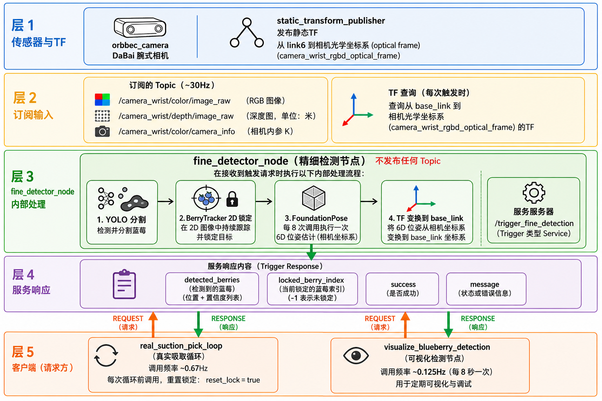
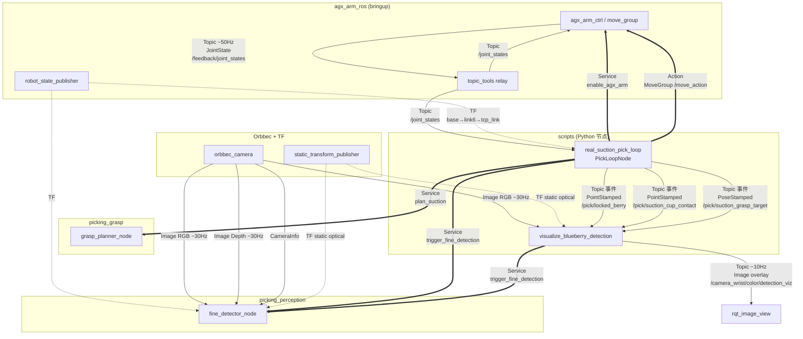
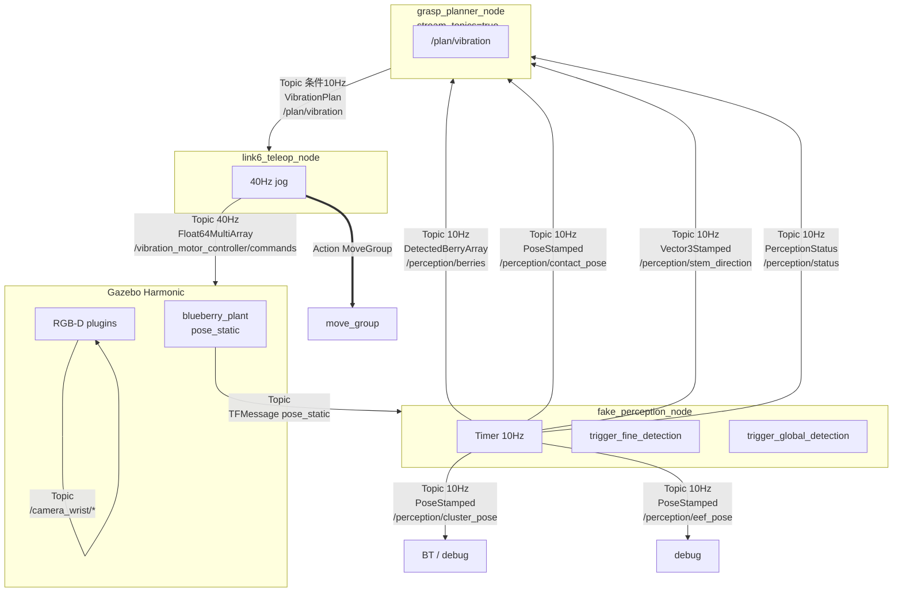
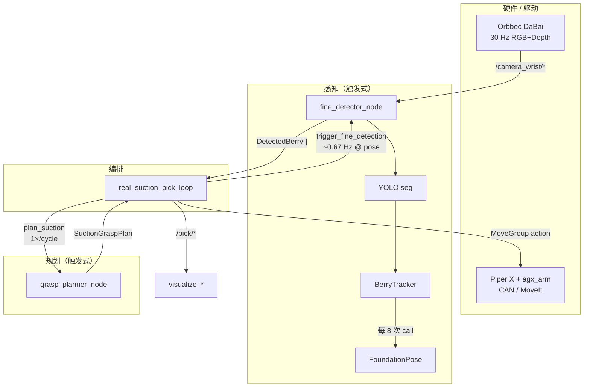

# Blueberry Picking System — Architecture (v3.0 — Reach)

本文档描述 ROS 2 通信架构。**真机主路径已收敛为触达管线**（见 [`docs/REACH_PIPELINE.md`](docs/REACH_PIPELINE.md)）。

---

## 1. 设计总览

| 主线 | 场景 | 感知模式 | 运动编排 |
|------|------|----------|----------|
| **真机（主）** | Piper X + 固定单目 + Orbbec 手腕 | **Topic 流** `/perception/global|fine/berries` | `reach_fsm_node`（触达→确认→reset） |
| **仿真** | Gazebo + MoveIt | 流式 `/perception/*` + 可选 service | BT / teleop（本迭代不维护） |
| **旧真机采摘** | service `trigger_fine_detection` | 已 deprecated | `run_real_suction_pick.sh` |

核心设计原则：

1. **真机触达 = topic 消费**  
   固定相机锁定目标（`/perception/target_lock`）；手腕 YOLO+depth 发 `/perception/fine/berries`；FSM 发 `/reach/plan` / `/reach/status`。不新增业务 service。

2. **双相机分工**  
   固定单目：选定采集对象。手腕 RGB-D：触达用 3D（深度优先，失败用尺寸先验）。

3. **规划单轨**  
   Reach 路径在 FSM 内 Python cup-axis 规划，跳过 C++ `plan_suction` + Python refine 双轨。

4. **仿真**  
   仍可保留 service 兼容 BT；与真机入口分离。
---

## 2. 坐标系

| Frame | 说明 |
|-------|------|
| `base_link` | Piper X 基座 |
| `link6` | 腕部法兰（坐标系 7；相机物理安装参考系） |
| `tcp_link` | 吸盘杯口接触点（`suction_eef.urdf.xacro`，link6 +Z 约 5 cm） |
| `eef_link` | 仿真 / 振动棒 MoveIt 规划 tip |
| `camera_wrist_color_optical_frame` | 手腕 RGB 光学系（真机：与 link6 **同向**，光轴 = +Z，仅平移 -Y 8 cm） |
| `camera_fixed_optical_frame` | 固定 4K 单目光学系（真机粗定位；外参见 `FIXED_CAM_*` / `calibration/fixed_camera_to_base.yaml`，当前占位） |

真机 TF 链（简化）：

```
base_link → … → link6 → [static] → camera_wrist_color_optical_frame
base_link → … → link6 → [fixed joint] → tcp_link
base_link → [static] → camera_fixed_optical_frame
```

Orbbec：**SDK v1**（`OrbbecSDK_ROS2_main` + `dabai.launch.py`），`publish_tf:=false`；由 `real_robot_bringup.sh` 发布 link6→optical 静态 TF（默认 `CAMERA_MOUNT_TY=-0.08`）。
---

## 3. 消息与服务定义（`picking_msgs`）

### 3.1 消息

| 类型 | 字段摘要 | 用途 |
|------|----------|------|
| `DetectedBerry` | `header`, `pose` (PoseStamped), `confidence` | 单颗蓝莓在 `base_link`（或 fallback 相机系）的 3D 位姿 |
| `DetectedBerryArray` | `header`, `berries[]` | 仿真流式发布多颗果 |
| `PerceptionStatus` | `cluster/contact/stem/berries/eef_valid`, `berry_count`, `message` | 仿真感知健康度；振动 stream 规划门控 |
| `SuctionGraspPlan` | `pre_grasp`, `grasp`, `post_grasp` (PoseStamped) | 吸盘三段式 6D 路径 |
| `VibrationPlan` | slot/hover/vibrate/dump poses 等 | 振动棒采摘路径 |

### 3.2 服务

| 服务 | Request | Response | 说明 |
|------|---------|----------|------|
| `TriggerFineDetection` | `reset_lock` (bool) | `detected_berries[]`, `locked_berry_index`, `success`, `message` | **真机主感知入口**；`reset_lock=true` 清除 2D 跟踪锁 |
| `TriggerGlobalDetection` | （空） | `cluster_pose`, `success` | 固定相机 HSV 粗定位（仿真/备用） |
| `PlanSuction` | `berries[]` | `plan` (SuctionGraspPlan), `success` | C++ 吸盘几何规划 |
| `PlanVibration` | `berries[]`, stem/contact | `plan` (VibrationPlan), `success` | 振动棒规划 |

### 3.3 真机辅助 Topic（非 `picking_msgs`）

| Topic | 类型 | 发布者 | 订阅者 | 说明 |
|-------|------|--------|--------|------|
| `/pick/locked_berry` | `PointStamped` | `real_suction_pick_loop` | `visualize_blueberry_detection` | 当前锁定果的 3D 点（与规划一致） |
| `/pick/suction_cup_contact` | `PointStamped` | pick loop | viz | 规划杯口接触点 |
| `/pick/suction_grasp_target` | `PoseStamped` | pick loop | viz | 规划 grasp 6D 位姿 |
| `/camera_wrist/color/detection_viz` | `sensor_msgs/Image` | viz 脚本 | rqt | 叠加检测框的 RGB |

---

## 4. ROS 通信拓扑图（Topic / Service / Action）

下图标注 **话题名、消息类型、载荷含义、典型频率**。  
图例：`──►` Topic 流式，`⇢` Service 请求/响应，`⤏` Action，`···►` TF。

### 4.1 `fine_detector_node`（真机精细感知）

**结论：只订阅相机 + 只提供 Service，不发布任何 Topic。**

| 方向 | 名称 | 类型 | 传输内容 | 频率 |
|------|------|------|----------|------|
| **订阅** | `/camera_wrist/color/image_raw` | `sensor_msgs/Image` | RGB 图（`rgb8`/`bgr8`，640×480）；节点内缓存 **最新一帧** | 连续 **~30 Hz**（相机）；本地 `queue_depth=1` |
| **订阅** | `/camera_wrist/depth/image_raw` | `sensor_msgs/Image` | 对齐深度（`32FC1` 米 / `16UC1` mm）；与 RGB 同场景 | 连续 **~30 Hz** |
| **订阅** | `/camera_wrist/color/camera_info` | `sensor_msgs/CameraInfo` | 内参矩阵 `K`、畸变、`frame_id`；首次收到后缓存 | 相机发布频率 |
| **订阅 (TF)** | `/tf`, `/tf_static` | `tf2` | 查询 `base_link` ← `camera_wrist_color_optical_frame` 变换 | 静态 + 动态树 |
| **服务 (提供)** | `/trigger_fine_detection` | `TriggerFineDetection` | **Request:** `reset_lock` 是否清除 2D 跟踪<br/>**Response:** `detected_berries[]`（每颗 `pose`+`confidence`）、`locked_berry_index`、`success`、`message` | **触发式**；由 pick loop / viz 调用，非自驱动 |
| **发布** | — | — | **无** | — |



*图：五层结构 — 驱动 → 订阅 Topic → fine_detector（仅 Service）→ 响应载荷 → 调用方。英文版见 [`docs/diagrams/fine_detector_topology.jpg`](docs/diagrams/fine_detector_topology.jpg)；源文件 [`docs/diagrams/fine_detector_topology_v2.dot`](docs/diagrams/fine_detector_topology_v2.dot) 可用 `dot -Tjpg` 重新导出。*

<details>
<summary>Mermaid 源码（可选，IDE 外可读性较差）</summary>

```mermaid
flowchart TB
  ORB[orbbec_camera] --> T1[/color/image_raw ~30Hz/]
  ORB --> T2[/depth/image_raw ~30Hz/]
  ORB --> T3[/color/camera_info/]
  STF[static_transform_publisher] -. TF .-> FD[fine_detector_node]
  T1 & T2 & T3 --> FD
  PL[real_suction_pick_loop] ==>|trigger_fine_detection| FD
  VIZ[visualize_blueberry_detection] ==>|trigger_fine_detection| FD
  FD --> R[DetectedBerry[] + locked_berry_index]
  R --> PL & VIZ
```

</details>

---

### 4.2 真机吸盘采摘 — 全栈拓扑

涉及 **外部包**（`agx_arm_ros`、`OrbbecSDK_ROS2`）与 **本仓库脚本节点**。



#### 真机 Topic / Service 明细表

| 话题 / 接口 | 类型 | 发布者 → 订阅者 | 载荷说明 | 模式 / 频率 |
|-------------|------|-----------------|----------|-------------|
| `/camera_wrist/color/image_raw` | `sensor_msgs/Image` | orbbec → fine_detector, viz, 采图脚本 | 手腕 RGB | 连续 ~30 Hz |
| `/camera_wrist/depth/image_raw` | `sensor_msgs/Image` | orbbec → fine_detector | 对齐深度 (m) | 连续 ~30 Hz |
| `/camera_wrist/color/camera_info` | `sensor_msgs/CameraInfo` | orbbec → fine_detector, viz | fx,fy,cx,cy, frame_id | 连续 |
| `/feedback/joint_states` | `sensor_msgs/JointState` | agx_arm → relay | 6 关节名 + 位置/速度 | ~50 Hz |
| `/joint_states` | `sensor_msgs/JointState` | relay → pick loop, teleop, record_pose | 同上（别名） | ~50 Hz |
| `/pick/locked_berry` | `geometry_msgs/PointStamped` | pick loop → viz | 锁定果心 `base_link` (x,y,z) | 事件（LOCK 时） |
| `/pick/suction_cup_contact` | `geometry_msgs/PointStamped` | pick loop → viz | 规划杯口接触点 | 事件（PLAN 后） |
| `/pick/suction_grasp_target` | `geometry_msgs/PoseStamped` | pick loop → viz | 规划 grasp 6D 位姿 | 事件（PLAN 后） |
| `/camera_wrist/color/detection_viz` | `sensor_msgs/Image` | viz → rqt | 画框 RGB overlay | ~10 Hz |
| `/teleop/link6_command` | `geometry_msgs/PoseStamped` | link6_teleop → (debug) | 目标 link6 位姿 | 40 Hz（teleop 时） |
| `/teleop/link6_state` | `geometry_msgs/PoseStamped` | link6_teleop → (debug) | 当前 link6 位姿 | 40 Hz |
| `/trigger_fine_detection` | `TriggerFineDetection` | pick loop, viz **→** fine_detector | 见 §4.1 | 触发 ~0.1–1 Hz |
| `/plan_suction` | `PlanSuction` | pick loop **→** grasp_planner | Req: berries[]；Rsp: pre/grasp/post | 1×/cycle |
| `/enable_agx_arm` | `std_srvs/SetBool` | pick loop **→** agx_arm | true=上使能 | 启动时 |
| `/move_action` | `moveit_msgs/MoveGroup` | pick loop, teleop **→** move_group | 关节/笛卡尔目标 | 按需 |
| `/compute_ik` | `moveit_msgs/GetPositionIK` | teleop **→** move_group | link6 目标 → joint解 | 40 Hz（teleop） |
| `/arm_controller/follow_joint_trajectory` | `FollowJointTrajectory` | teleop **→** controller | 关节轨迹 | 40 Hz（teleop） |
| TF `base_link→link6→tcp_link` | `tf2` | robot_state_publisher | 机械臂正解 | 连续 |
| TF `link6→camera_wrist_color_optical_frame` | `tf2_static` | static_transform_publisher | 手眼平移 (-Y 8cm) | 静态 |

---

### 4.3 仿真 Gazebo — 振动 teleop 拓扑

仿真中 **`fake_perception_node`** 同时 **10 Hz 流式 Topic** + **Service**（兼容 BT）。



#### 仿真 `/perception/*` Topic 载荷

| Topic | 类型 | 内容 |
|-------|------|------|
| `/perception/berries` | `DetectedBerryArray` | 当前枝条上所有果的 `base_link` 位姿 + 置信度 |
| `/perception/contact_pose` | `PoseStamped` | 振动棒应接触的枝条点 |
| `/perception/stem_direction` | `Vector3Stamped` | 枝条主轴方向（PCA） |
| `/perception/cluster_pose` | `PoseStamped` | 果簇中心粗定位 |
| `/perception/eef_pose` | `PoseStamped` | 当前末端在 `base_link` |
| `/perception/status` | `PerceptionStatus` | 各字段 valid 标志 + `berry_count` |
| `/plan/vibration` | `VibrationPlan` | slot/hover/vibrate/dump 等位姿序列 |

---

### 4.4 其他节点接口速查

| 节点 | 订阅 Topic | 发布 Topic | 提供 Service | 调用 Service / Action |
|------|------------|------------|--------------|------------------------|
| **`fine_detector_node`** | 相机 RGB/Depth/Info | **无** | `trigger_fine_detection` | — |
| **`grasp_planner_node`** (真机) | 无 | 无 | `plan_suction`, `plan_vibration` | — |
| **`grasp_planner_node`** (仿真振动) | `/perception/*` | `/plan/vibration` | 同上 | — |
| **`fake_perception_node`** | Gazebo `pose_static` | `/perception/*` ×6 | `trigger_fine/global_detection` | — |
| **`global_detector_node`** | `/camera_fixed/image_raw` | 无 | `trigger_global_detection` | — |
| **`real_suction_pick_loop`** | `/joint_states` | `/pick/*` ×3 | 无 | `trigger_fine_detection`, `plan_suction`, `enable_agx_arm`, `MoveGroup` |
| **`visualize_blueberry_detection`** | 相机 RGB/Info, `/pick/*` | `detection_viz` | 无 | `trigger_fine_detection` |
| **`link6_teleop_node`** | `/joint_states` | `/teleop/link6_*`, 振动 commands | 无 | `GetPositionIK`, `MoveGroup`, `FollowJointTrajectory` |
| **`orbbec_camera`** | — | `/camera_wrist/*` | 驱动参数 | — |
| **`topic_tools relay`** | `/feedback/joint_states` | `/joint_states` | 无 | — |
| **`static_fake_perception_node`** | 无 | 无 | fine + global detection | —（BT mock） |

---

### 4.5 真机 vs 仿真 — 感知接口对比

| 能力 | 真机 `fine_detector_node` | 仿真 `fake_perception_node` |
|------|---------------------------|-----------------------------|
| 连续 Topic | ❌ 不发布 | ✅ `/perception/*` @10 Hz |
| 触发 Service | ✅ `trigger_fine_detection` | ✅ 同名（返回 GT+噪声） |
| 算法 | YOLO + FP + BerryTracker | Gazebo GT 几何 |
| 典型消费者 | pick loop（主）、viz（调试） | grasp_planner stream、BT、teleop |

---


### 4.1 真机栈（`real_robot_bringup.sh`）

```
┌─────────────────────────────────────────────────────────────────────────┐
│                         真机运行时节点                                    │
├─────────────────────┬───────────────────────────────────────────────────┤
│ agx_arm_ctrl        │ CAN → Piper X；MoveIt move_group；FollowJointTrajectory │
│ topic_tools relay   │ /feedback/joint_states → /joint_states              │
│ orbbec_camera       │ DaBai RGB-D 驱动                                   │
│ static_transform    │ link6 → camera_wrist_color_optical_frame          │
│ fine_detector_node  │ YOLO + FP + BerryTracker；trigger_fine_detection    │
│ grasp_planner_node  │ plan_suction（stream_topics=false）                │
│ link6_teleop_node   │ 可选；键盘 jog + IK                                │
│ real_suction_pick   │ 采摘状态机（独立进程，非 bringup 内置）              │
│ visualize_*         │ 可选；检测可视化                                    │
└─────────────────────┴───────────────────────────────────────────────────┘
```

#### `orbbec_camera`（OrbbecSDK_ROS2）

| 项 | 值 |
|----|-----|
| **模式** | 连续流 |
| **帧率** | RGB **30 Hz**，Depth **30 Hz**（`dabai.launch.py` 默认 640×480 / 640×400） |
| **发布** | `/camera_wrist/color/image_raw`, `/camera_wrist/depth/image_raw`, `camera_info` |
| **设计** | 硬件最大吞吐；感知按需取样，不背压相机 |

#### `fine_detector_node`

| 项 | 值 |
|----|-----|
| **模式** | **纯 Service 触发**（无 `/perception/*` 输出） |
| **订阅** | RGB / Depth / CameraInfo（各 `queue_depth=1`，只保留最新帧） |
| **服务** | `trigger_fine_detection` |
| **单次调用内部流程** | ① YOLO 分割（每 call 必跑）→ ② BerryTracker 2D 锁定 → ③ 深度融合 / ③' FoundationPose（降频）→ ④ TF → `base_link` |
| **有效识别帧率** | **由调用方决定**（非自驱动） |

**BerryTracker 内部降频（相对 service 调用次数，非 wall-clock）：**

| 参数 | 默认 | 含义 |
|------|------|------|
| `fp_retry_interval` | 8 | 每 8 次 trigger 才对该目标重跑 FP `register()` |
| `track_lost_max_frames` | 8（yaml） | 连续丢失 YOLO 匹配帧数上限 |
| 初锁策略 | 图像 **v 最大**（最下方） | 符合「先摘低处果」 |

**单次 trigger 典型耗时：**

| 阶段 | 耗时量级 |
|------|----------|
| YOLO（`best.pt`） | ~50–300 ms（CPU/GPU） |
| FP `register()`（est_refine_iter=5） | ~1–5 s / 目标 |
| 仅 mono depth + coast | ~YOLO 时间 |

#### `grasp_planner_node`

| 项 | 值 |
|----|-----|
| **模式** | **Service 触发**（真机 `stream_topics:=false`） |
| **服务** | `plan_suction`, `plan_vibration` |
| **真机** | 仅 `plan_suction`；选最近果 / 指定 index；输出 pre/grasp/post 6D（tcp +Z 朝果） |
| **仿真振动** | `stream_topics:=true` 时订阅 `/perception/*` @10 Hz，自动发布 `/plan/vibration` |

#### `real_suction_pick_loop.py`（`PickLoopNode`）

| 项 | 值 |
|----|-----|
| **模式** | 状态机；**主动调用** perception + planning service |
| **Action** | `MoveGroup`（默认 `/move_action`） |
| **Service 客户端** | `trigger_fine_detection`, `plan_suction`, `enable_agx_arm` |
| **发布** | `/pick/locked_berry`, `/pick/suction_cup_contact`, `/pick/suction_grasp_target` |

**采摘周期（默认 `config/pick_scan_poses.env`）：**

```
HOME (joint 0) ──dwell 3s──► TELEOP POSE ──dwell 3s──► DETECT ×3 (间隔 1.5s)
    │                              │
    │                              └── 找到果 → LOCK → PLAN → MOVE
    └── 可选 PATROL（joint grid + detect）
```

| 阶段 | 触发频率 | 说明 |
|------|----------|------|
| 到位 settle | 每 pose **1×**，**3 s** | 机械振动 + 曝光稳定 |
| `trigger_fine_detection` | 每 pose **最多 3 次**，间隔 **1.5 s** | ≈ **0.67 Hz** 检测节拍 |
| `plan_suction` | 锁定后 **1 次** | |
| MoveIt 运动 | 按 pre→grasp→post **3 次** action | 非感知相关 |

**为何 dwell + 低频 detect：** 腕部相机随臂运动；刚到位时 motion blur / 深度空洞未收敛。3 s settle 换稳定 mask；1.5 s 间隔避免 FP 重叠排队。

#### `visualize_blueberry_detection.py`

| 项 | 值 |
|----|-----|
| **模式** | Timer 驱动；**主动 call** `trigger_fine_detection` |
| **画面刷新** | `--rate-hz` 默认 **10 Hz**（仅重绘 overlay） |
| **检测触发** | `--fp-interval` 默认 **8.0 s** → 有效 **~0.125 Hz** |
| **设计** | 调试工具，默认极低 FP 频率以免与 pick loop 抢 GPU；**不代表相机或系统上限** |

#### `link6_teleop_node`

| 项 | 值 |
|----|-----|
| **控制环** | **40 Hz** timer → IK → `FollowJointTrajectory` |
| **振动 tick** | **20 Hz**（0.05 s） |
| **发布** | `/teleop/link6_command`, `/teleop/link6_state` |
| **与感知** | **无直接耦合**；teleop 期间不自动 detect |

---

### 4.2 仿真栈

#### `fake_perception_node`

| 项 | 值 |
|----|-----|
| **模式** | **流式 + Service 双接口** |
| **流式帧率** | **10 Hz**（`stream_rate_hz`，timer） |
| **输入** | Gazebo `/model/blueberry_plant/pose_static` |
| **发布** | `/perception/berries`, `/perception/contact_pose`, `/perception/stem_direction`, `/perception/status`, … |
| **服务** | `trigger_fine_detection`, `trigger_global_detection`（与 BT 兼容） |
| **设计** | GT 计算轻量；振动 teleop 需连续反馈；加噪声模拟吸盘/振动精度 |

#### `global_detector_node`

| 项 | 值 |
|----|-----|
| **模式** | Service 触发 |
| **输入** | `/camera_fixed/image_raw`（缓存最新帧） |
| **算法** | HSV + 尺寸先验 → 簇中心 3D |
| **用途** | 固定相机粗定位；真机当前未启用 |

#### `grasp_planner_node`（振动 + stream）

订阅 `/perception/*` @10 Hz，当 `contact_valid && stem_valid && berries_valid` 时发布 `/plan/vibration`。

#### `picking_task`（BehaviorTree）

通过 service/action 编排仿真全流程；真机第一版 **未接入** BT，由 `real_suction_pick_loop` 替代。

---

## 5. 节点实现与算法详解

本节说明 **每个节点内部做了什么运算**、**数据如何一步步变换**，以及 **为何采用当前顺序**（尤其：为何 YOLO 分割后做 2D tracking，而不是先 6D 再 track）。

### 5.1 `fine_detector_node` — 单次 `trigger_fine_detection` 流水线

**入口：** `fine_detector_node._on_detect()`（`fine_detector_node.py`）

```
缓存 RGB/Depth/K
    ↓
[mask_source=yolo] YoloBerryDetector.detect(rgb)
    ↓
BerryTracker.process(yolo_dets, rgb, depth, k, fp, reset_lock?)
    ↓
对每个 TrackedBerry: pose_cam (4×4) → TF → base_link
    ↓
填充 TriggerFineDetection.Response
```

#### Step A — YOLO 分割（每 call 必跑）

`YoloBerryDetector.detect()`（`yolo_berry_detector.py`）：

1. `ultralytics.YOLO.predict(rgb)` — 当前真机用 `runs/detect/blueberry-4/weights/best.pt`（闭集），或 YOLOE 开词模式。
2. 取 instance **mask**（无 mask 时用 bbox 拟合椭圆 mask）。
3. **几何过滤**：面积 120px–4% 画面、圆度 ≥0.45、长宽比 ≤2、远离边缘 2%。
4. 按 confidence 排序，最多 `max_detections`（默认 6）颗。

**输出：** `List[YoloDetection{mask, confidence, bbox_xyxy}` — **纯 2D**，尚无 3D。

#### Step B — BerryTracker（2D 锁定 + 轻量 3D）

`BerryTracker.process()`（`berry_tracker.py`）在 **同一帧 YOLO 结果** 上工作：

| 子步骤 | 算法 | 输出 |
|--------|------|------|
| B1 深度采样 | mask 内 depth 中值；有效像素 ≥15 | `z_depth` 或 None |
| B2 单目深度 | 假设果径 15mm：`z = fx * (d/2) / r_px` | `z_mono` |
| B3 可选 FP | 每 **8 次** trigger 且 B1 有效时，`FP.register(rgb,depth,k,mask)` | `pose_fp` 4×4 或跳过 |
| B4 融合 3D | 有 depth：`z=0.65*z_depth+0.35*z_mono`；无 depth：mono/coast | 相机系 (x,y,z) |
| B5 2D→3D | 针孔：`x=(u-cx)*z/fx`, `y=(v-cy)*z/fy` | `TrackedBerry.pose_cam` |
| B6 锁定 | 无锁：选 **图像 v 最大**（最下方）；有锁：bbox IoU + 像素距离匹配 | `lock_idx` |

**模式字段 `mode`：** `fp` | `mono` | `coast`（YOLO 丢检时用上次 uv+z 外推）。

#### Step C — TF 变换

```python
T_base_cam = lookup(base_link ← camera_wrist_color_optical_frame)
T_out = T_base_cam @ pose_cam   # 每颗果
```

TF 失败时 fallback 返回 **相机系** 位姿（仅平移，四元数 w=1）。

---

### 5.2 设计问答：为何「YOLO → 2D Track → 按需 FP」，而不是「先 6D 再 Track」？

| 方案 | 问题 |
|------|------|
| **先 FP 6D 再 3D tracking** | FP `register()` **~1–5 s/次**，无法 10 Hz；6D 在近距离 depth 空洞时抖动大，track 难收敛 |
| **当前：2D track + 轻量 3D + 降频 FP** | YOLO **~50–300 ms** 可每 trigger 跑；**身份**用 2D bbox/uv 关联（IoU+像素距），便宜稳定；深度中值 + 果径先验给 **够用** 的 grasp 距离；FP 仅作 ** occasional 精化** |

**核心原因：**

1. **触发式 + 静态观测**：臂停稳后一次 trigger 是一「快照」，不需要 Kalman 3D 滤波跨 30 Hz 相机流；需要的是 **「哪一颗果」**（2D 身份）和 **粗略 3D**。
2. **Eye-in-hand 近距**：靠近时 depth mask 缩小甚至无效；2D uv 仍稳定，故 lock 在 **图像平面**；z 用 mono（果在图中变大 → z 变小）比 stale 3D 更可靠（见 `_track_one` 注释）。
3. **FP 是可选精化，不是每帧必需**：mesh 对齐慢；8 次 trigger 才 refine 一次，中间 mono/coast 足够支撑 **扫描→锁定→规划**。
4. **若先 6D**：每颗候选都跑 FP → N 颗果 × 数秒，单次 service 超时；且 FP 对 mask 质量敏感，应在 YOLO 筛完后对 **锁定那一颗** 偶发运行。

**未使用 FP `track_one()` 连续跟踪的原因：** 当前架构是 service 快照而非视频流；`track_one` 适合帧间连续 RGB-D，需重构为 streaming node（见 §11 FAQ）。

---

### 5.3 `FoundationPoseWrapper` — 6D 精化做了什么

`detect_all(rgb, depth, k, mask)`（`foundation_pose_wrapper.py`）：

1. `cv2.connectedComponents(mask)` 拆连通域（每域 ≥200 px）。
2. 每域新建 `FoundationPose` estimator（mesh=`blueberry.obj`）。
3. 调用 **`register(K, rgb, depth, ob_mask, iteration=5)`**：
   - ScorePredictor 粗姿态候选
   - PoseRefinePredictor 迭代 refine（`est_refine_iter=5`）
   - nvdiffrast 渲染比对
4. 返回相机系 **4×4 pose** + score；score ≥ threshold 才采纳。

**注意：** 真机 YOLO+Tracker 路径只对 **锁定那颗** 在 `try_fp` 帧尝试 FP（在 `_track_one` 内对 **每个** det 调用，但 `try_fp` 全局为 false 时全部跳过）。初锁后 `frames_since_fp` 重置。

---

### 5.4 `grasp_planner_node` + `SuctionPlanner` — 几何规划（不用 MoveIt）

**真机：** 仅 `plan_suction` service；**不调用 MoveIt**，纯 C++ 几何。

`SuctionPlanner::plan()`（`suction_planner.cpp`）：

1. **选果：** `selectionMetric` — 默认 `nearest` + `nearest_frame=camera_wrist_color_optical_frame` → 选 **光学系 z 最小**（最近）的果；pick loop 传入 **仅锁定 1 颗** 时此步 trivial。
2. **接近方向：** `a = normalize(berry_position)`（相机系下从光心指向果心的单位向量）。
3. **杯口姿态：** `quatAlignPosZTo(a)` — 令 **tcp +Z**（杯口朝外）对齐 `a`。
4. **三点位置**（沿 **远离果心** 方向退 cup/offset）：
   - `grasp = berry - a * cup_contact_offset`（杯口接触果心）
   - `pre_grasp = berry - a * (cup + pre_grasp_offset)`（默认 +15cm）
   - `post_grasp = berry - a * (cup + post_grasp_offset)`（默认 +12cm）

**输出：** `SuctionGraspPlan` 三个 `PoseStamped`（**粗规划**，可能在相机系或 base_link，取决于感知 TF）。

---

### 5.5 `real_suction_pick_loop` — 规划 refine + MoveIt 运动

采摘循环在 C++ 规划之后还有 **Python 几何 refine** 和 **MoveIt 路径规划**，二者分工不同。

#### Phase 1 — 感知锁定（见 §5.1）

`trigger_fine_detection` → 取 `locked_berry_index` 对应 **唯一一颗** `DetectedBerry`。

#### Phase 2 — C++ 粗 plan

`plan_suction(berries=[locked])` → `pre_grasp / grasp / post_grasp`。

#### Phase 3 — Python refine（eye-in-hand，关键）

`_refine_suction_plan_toward_berry()`（`real_suction_pick_loop.py`）**覆盖** C++ 输出的位置/姿态逻辑：

1. `berry_base = TF(berry.pose → base_link)` — 锁定果心在基座系。
2. `ee = TF(tcp_link → base_link)` — 当前末端位姿（**保持观测时的腕姿**）。
3. **接近方向：** `a = normalize(berry_base - ee_pos)` — 从 **当前 tcp** 指向果心（非从相机原点）。
4. **姿态：** **沿用当前 ee 四元数**（不强制重算 cup+Z），避免 OMPL 6D 不可达；失败时 fallback 用 `_quat_cup_toward_berry(a)`。
5. **三点位置：**
   ```
   pre_grasp  = berry_base - a * (cup_offset + pre_grasp_offset)
   grasp      = berry_base - a * cup_offset
   post_grasp = berry_base - a * (cup_offset + post_grasp_offset)
   ```
   默认 `cup=0.04m`, `pre=0.15m`, `post=0.12m`。
6. 发布 `/pick/locked_berry`, `/pick/suction_cup_contact`, `/pick/suction_grasp_target` 供 viz 对齐。

**为何需要 refine：** C++ planner 假设「从相机光心看向果」；真机 eye-in-hand 抓取应沿 **当前 tcp→果** 接近，且腕部姿态已在观测位调优，不宜被 planner 强行改姿态。

#### Phase 4 — MoveIt 路径规划与执行

**Planner：** MoveIt **`move_group`**，默认 pipeline **`ompl_interface/OMPLPlanner`**（`ompl_planning.yaml`），**采样-based 关节空间/约束空间规划**，非笛卡尔直线插值器。

**Action：** `/move_action`（`moveit_msgs/MoveGroup`）

| 运动类型 | 构建函数 | 约束 | 用途 |
|----------|----------|------|------|
| 回零 / 遥操位 | `_build_joint_goal` | 6× `JointConstraint` ±0.03 rad | HOME、patrol 扫描位 |
| 抓取三点 | `_build_pose_goal` | `PositionConstraint` 球 ±2cm + `OrientationConstraint` ±0.35 rad | pre/grasp/post **6D** |
| fallback | `_build_position_goal` | 仅位置球 ±tolerance | 6D 失败（error 99999）时降级 |
| z-search | `_build_pose_goal` | 沿相机 +Z 小步移动 | 找不到果时微调 |

**执行参数：** `num_planning_attempts=10`, `allowed_planning_time=8–10s`, `replan_attempts=3`, `velocity_scaling_factor` 默认 0.2。

**`_execute_move_goal` 流程：**

```
send_goal(MoveGroup) → move_group 内部 OMPL 规划 + 碰撞检测
    → trajectory execution → arm_controller
    → 等待 SUCCESS / 报错 99999 等
```

**不使用的 MoveIt 能力：** 当前 **未** 调用 `computeCartesianPath`；三点之间是 **各自独立 OMPL 规划**，不保证直线笛卡尔路径。

**完整 MOVE 序列（`--move`）：**

```
OMPL → pre_grasp
OMPL → grasp  → 等待吸盘（G 或 auto-retreat 4s）
OMPL → post_grasp
trigger_fine_detection(reset_lock=true)  # 清除 tracker
```

---

### 5.6 其他节点实现摘要

#### `fake_perception_node`（仿真）

- 订阅 Gazebo `pose_static` → 解析 plant link 位姿。
- `_analyze_cluster()`：几何计算果簇、枝条接触点、PCA 茎方向 + 高斯噪声（吸盘 3mm / 振动 15mm）。
- Timer 10 Hz 发布 `/perception/*`；service 路径返回同一套 GT 数据供 BT。

#### `global_detector_node`

- HSV 分割 → 质心 + 面积估计距离 → 粗 `cluster_pose`（固定相机）；真机未启用。

#### `link6_teleop_node`

- 40 Hz：键盘积分 **link6 目标位姿** → `GetPositionIK`（MoveIt IK service）→ `FollowJointTrajectory`。
- 与感知 **无耦合**；`R` 键走 `MoveGroup` 回零（joint constraint，同 pick loop HOME）。

#### `visualize_blueberry_detection`

- 10 Hz 重绘；异步 call `trigger_fine_detection`；将 3D 果投影到图像 + 叠加 `/pick/*` 投影点。

---

### 5.7 真机吸盘采摘 — 算法数据流总图

```
[相机 30Hz] ──► fine_detector:
                  YOLO 2D masks
                    → BerryTracker: 2D lock + z_mono/depth (+ FP 每8次)
                    → TF → DetectedBerry in base_link
              ──► pick loop LOCK (1 berry)
              ──► SuctionPlanner (C++): 粗 pre/grasp/post
              ──► refine (Python): tcp→berry, 保持腕姿, base_link 6D
              ──► MoveGroup/OMPL ×3: 关节轨迹执行
```

---

## 6. 数据流图（逻辑）

### 6.1 真机吸盘采摘（主路径）



### 6.2 仿真振动 teleop（流式）


---

## 7. 帧率与触发方式汇总

| 组件 | 连续/触发 | 频率 | 备注 |
|------|-----------|------|------|
| Orbbec RGB/Depth | 连续 | **30 Hz** | 仅图像流 |
| `fine_detector_node` | **触发** | 0–∞（调用方定） | 真机无自定时器 |
| pick loop detect | **触发** | **~0.67 Hz**（1.5 s 间隔 ×3） | + 3 s settle |
| viz overlay 刷新 | 连续 timer | **10 Hz** | 只重绘，非新检测 |
| viz FP 调用 | **触发** | **0.125 Hz**（8 s 默认） | 可调 `--fp-interval 0.5` |
| YOLO（每次 trigger 内） | 触发内 | 1×/call | |
| FP register（tracker 内） | 触发内降频 | 1×/8 calls | 中间帧 mono/coast |
| `fake_perception` stream | 连续 | **10 Hz** | 仅仿真 |
| `link6_teleop` | 连续 | **40 Hz** | 运动控制 |
| `grasp_planner` 真机 | **触发** | 1×/pick | `plan_suction` |
| `grasp_planner` 仿真振动 | 连续订阅 | **10 Hz** 输入 | 条件满足才 publish plan |

---

## 8. 真机完整采摘时序（一次 cycle）

```
t=0     HOME → joint 0
t=3s    settle 完成
t=3s    移至 teleop pose 1（MoveIt，秒级）
t=6s    settle 3s
t=6s    trigger_fine_detection #1  ──► YOLO + (FP if 首锁)
t=7.5s  trigger #2（若无果）
t=9s    trigger #3
        ├─ 有果 → LOCK（locked_berry_index）→ plan_suction → MOVE ×3
        └─ 无果 → 下一 teleop pose 或 PATROL
```

感知 **不是** 30 Hz 跟踪相机，而是 **「停稳 → 拍一张 → 算一次」**。

---

## 9. 包依赖

```
picking_msgs          ← 消息/服务定义
picking_description   ← URDF、相机/吸盘 xacro、标定 yaml
picking_moveit_config ← SRDF、move_group launch
picking_perception    ← fine/global/fake detector、YOLO、BerryTracker、FP wrapper
picking_grasp         ← suction/vibration planner (C++)
picking_bringup       ← sim launch、link6_teleop、robot_description
picking_task          ← BT 节点（仿真）

外部（piper_x_dev monorepo）:
  agx_arm_ros         ← 真机 CAN + MoveIt
  OrbbecSDK_ROS2_main ← 手腕相机
  FoundationPose      ← 6D 姿态（可选精化）
  pyAgxArm            ← CAN Python 库
```

---

## 10. 启动入口

| 命令 | 作用 |
|------|------|
| `bash scripts/real_robot_bringup.sh` | CAN + arm + MoveIt + Orbbec + 可选 perception |
| `bash scripts/run_real_suction_pick.sh --move --once` | bringup + grasp + pick loop + viz |
| `bash scripts/run_fine_detector_node.sh` | 单独起 perception |
| `bash scripts/run_grasp_planner.sh` | 单独起 `plan_suction` |
| `bash scripts/run_detection_viz.sh` | 可视化（可调 `--fp-interval`） |
| `ros2 launch picking_bringup sim_gz_suction.launch.py` | Gazebo 吸盘仿真 |

---

## 11. 设计取舍 FAQ

### Q: 为什么真机不用 10 Hz 流式感知？

1. **算力**：FP @ 640×480 无法稳定 10 Hz；YOLO 10 Hz 可行但 FP 不行，流式会队列积压、延迟增大。  
2. **需求**：吸盘采摘在 detect 时臂已静止，0.5–1 Hz 足够决策。  
3. **锁定语义**：`reset_lock` + 2D tracker 在 service 模型下更清晰；流式需额外同步「何时换目标」。  
4. **对比仿真**：Gazebo GT 几乎免费，且振动 teleop **必须**实时看枝条/接触位姿。

### Q: 为什么 viz 默认 8 秒才检测一次？

调试 overlay 不应默认占满 GPU；与 pick loop 并行时 8 s 间隔避免 FP 争抢。加速：

```bash
bash scripts/run_detection_viz.sh --fp-interval 0.5 --rate-hz 15
```

### Q: 有效感知帧率感觉低，如何提升？

| 手段 | 效果 |
|------|------|
| 减小 `PICK_SCAN_DETECT_INTERVAL_S` | pick 扫描更快 |
| 减小 `PICK_SCAN_SETTLE_S` | 到位后更快 detect（可能 blur） |
| 降低 `fp_retry_interval` / 跳过 FP | 每次 trigger 更快，精度降 |
| 实现 **YOLO-only 流式 topic**（待开发，§13.2 P-1） | 2–10 Hz 框 + 1 Hz FP 精化 |
| 已锁定后用 FP `track_one()` 代替 `register()`（待开发，§13.2 P-2） | 连续接近时更平滑 |

### Q: `plan_suction` 与 pick loop 内 refine 的关系？

- C++ `SuctionPlanner`：从 `DetectedBerry[]` 选果，生成几何 pre/grasp/post。  
- Python pick loop `_refine_suction_plan_toward_berry`：用锁定果 + 当前 tcp，**保持腕姿**沿 tcp→果方向微调 6D。  
- viz 订阅 `/pick/*` 是为显示 **最终执行** 的锁定点与杯口，而非 C++ 原始输出。

**技术债与改进路线见 §13.1（G-1～G-5）。**

---

## 12. 已知限制

- 真机未接入 BehaviorTree；编排集中在 `real_suction_pick_loop.py`。  
- `fine_detector_node` 不发布 `/perception/*`；仿真/真机感知接口不统一。  
- FoundationPose 需 GPU + 权重；无权重时 service 返回失败。  
- GPIO 气泵/继电器真机控制尚未接入 pick loop（`--auto-retreat` 仅计时 retreat）。  
- 振动模式真机路径未验证；当前主路径为吸盘 + eye-in-hand。

完整待办列表见 **§13 待办与 Roadmap**。

---

## 13. 待办与 Roadmap

以下条目来自真机调试与架构评审，按 **优先级** 分组。状态：`[ ]` 未开始，`[~]` 部分实现，`[x]` 已完成。

### 13.1 P0 — 抓取几何与规划一致性（技术债）

| ID | 状态 | 任务 | 动机 / 验收 |
|----|------|------|-------------|
| **G-1** | `[ ]` | **消除 C++ plan 与 Python refine 双轨** | 主路径 `real_suction_pick_loop` 在 Phase 2 调用 `plan_suction` 后，Phase 3 `_refine_suction_plan_toward_berry()` **几乎总是覆盖** C++ 输出的 pre/grasp/post。二选一：① 真机路径跳过 `plan_suction`，直接 Python refine；② 将 eye-in-hand 逻辑迁入 `SuctionPlanner`（C++）或扩展 `PlanSuction.srv`（增加 `current_tcp_pose` / `refine_mode` 字段）。 |
| **G-2** | `[ ]` | **方案 A：平移沿 tcp +Z（杯轴）** | 当前 refine 沿 **tcp→果直线** 退 pre/grasp/post；当果偏离杯轴时，杯口未对准果心。改为沿 **tcp 局部 +Z** 退距，使接触点始终在杯轴上。 |
| **G-3** | `[ ]` | **方案 B：两阶段姿态** | `pre_grasp` **保持观测腕姿**（便于 OMPL 6D 可达）；`grasp` 用 `_quat_cup_toward_berry(a)` 令杯口 +Z 对准接近方向 `a`。需验证 OMPL 99999 降级频率。 |
| **G-4** | `[ ]` | **方案 C：`--probe-only` 夹角诊断** | 打印 **杯轴（tcp +Z）** 与 **tcp→果向量** 夹角 θ；θ 超过阈值（如 15°–25°）时拒绝抓取或提示换 scan pose，避免 silent miss。 |
| **G-5** | `[ ]` | **MoveIt 笛卡尔路径（可选）** | pre→grasp→post 现为三次独立 OMPL；接近段可试 `computeCartesianPath` 保证沿杯轴直线插入。 |

**当前妥协（文档化，非终态）：** Phase 3 默认 **锁当前 ee 四元数**，是为在观测 scan pose 下提高 OMPL 成功率；代价是果偏离杯轴时吸盘不对准。**G-2/G-3/G-4** 旨在解除该妥协。

### 13.2 P1 — 感知性能与接口

| ID | 状态 | 任务 | 动机 / 验收 |
|----|------|------|-------------|
| **P-1** | `[ ]` | **YOLO 流式 topic（2–10 Hz）+ FP 降频（~1 Hz）** | 相机 30 Hz 与 trigger 检测 ~0.1–1 Hz 脱节；viz / teleop 需要更流畅 2D 框。YOLO 连续 pub `/perception/yolo_*`（或等价），FP 仅在锁定或定时精化。 |
| **P-2** | `[ ]` | **锁定后用 FP `track_one()` 替代 `register()`** | 每次 trigger 全量 register（est_refine_iter=5）慢；tracker 已锁 2D 目标后，track 模式（track_refine_iter=2）更省算力、轨迹更平滑。 |
| **P-3** | `[ ]` | **统一真机 / 仿真感知出口** | 真机 `fine_detector_node` **不** pub `/perception/*`；仿真 `fake_perception_node` 10 Hz 流式。抽象统一 `DetectedBerry[]` 发布策略（service + 可选 topic），便于 BT 与 pick loop 共用。 |
| **P-4** | `[ ]` | **C++ / Python 边界清理** | 规划在 C++、refine 在 Python 是历史/生态原因，非架构铁律。评估将 pick loop 核心迁入 `picking_task` BT，或 consolidate 到单一语言层。 |

### 13.3 P2 — 真机能力与运维

| ID | 状态 | 任务 | 动机 / 验收 |
|----|------|------|-------------|
| **R-1** | `[ ]` | **真机接入 BehaviorTree** | 当前编排全在 `real_suction_pick_loop.py`；与仿真 BT 路径分叉，难以共享 detect→plan→move 节点。 |
| **R-2** | `[ ]` | **GPIO 气泵 / 继电器控制** | `--auto-retreat` 仅计时 retreat；需硬件吸盘 ON/OFF 与 grasp 时序联动。 |
| **R-3** | `[ ]` | **振动模式真机验证** | 仿真振动 teleop + `/perception/*` 已通；真机 eye-in-hand + 振动棒未测。 |
| **R-4** | `[ ]` | **扫描位姿质量评估** | 结合 G-4：录位时或 pick 前自动评估「该 scan pose 下可抓果的 θ 分布」，过滤劣质观测位。 |

### 13.4 P3 — 文档与可视化

| ID | 状态 | 任务 | 动机 / 验收 |
|----|------|------|-------------|
| **D-1** | `[x]` | **§4.1 fine_detector 中文拓扑 JPG** | `docs/diagrams/fine_detector_topology_cn.jpg` |
| **D-2** | `[ ]` | **§4.2 真机全栈拓扑 JPG** | 与 §4.1 同级：bringup + pick loop + MoveIt + 相机，便于 onboarding（Mermaid 已有，缺静态图）。 |
| **D-3** | `[ ]` | **抓取几何示意图** | 补充 cup+Z vs tcp→果 vs 两阶段姿态的示意（可并入 §5.5）。 |

### 13.5 建议实施顺序

```
G-4（probe 夹角，低成本诊断）
  → G-2 或 G-3（改 refine 几何，二选一 A/B 测试）
  → G-1（合并 plan/refine，去双轨）
  → P-2 + P-1（感知加速）
  → P-3 + R-1（接口与 BT 统一）
```

---

## 14. 版本历史

| 版本 | 变更 |
|------|------|
| v1.0 | 初始 BT + 仿真 fake 感知 |
| v2.0 | 真机 agx_arm + Orbbec + YOLO/BerryTracker + service 触发采摘；文档化帧率/触发策略 |
| v2.1 | 补充 `scripts/` 全量说明（职责、操作、依赖关系） |
| v2.2 | 新增 §4 ROS 通信拓扑图（Topic/Service 载荷与频率标注） |
| v2.3 | §4.1 增加 JPG 拓扑图（`docs/diagrams/fine_detector_topology_cn.jpg`） |
| v2.4 | 新增 §5 节点实现与算法详解（YOLO/Track/FP 顺序、Suction+MoveIt） |
| v2.5 | 新增 §13 待办与 Roadmap（规划/refine 技术债、感知加速、真机能力、文档图） |
| v3.0 | 真机主路径改为触达 topic 管线（固定单目锁目标 + 手腕精定位 + reach_fsm）；见 REACH_PIPELINE.md |
| v3.1 | 手腕相机改用 OrbbecSDK v1（`OrbbecSDK_ROS2_main`）；dry-run 全状态机验收通过 |

---

## 15. 脚本目录说明（`scripts/`）

所有脚本位于 `blueberry_picking_ws/scripts/`。按 **用途** 分组；`.sh` 多为环境封装 + 调用 `.py`，`.py` 为实际 ROS/算法逻辑。

### 13.1 真机运行 — 一键入口

| 脚本 | 说明 |
|------|------|
| **`run_real_reach.sh`** | sh | **主入口**：bringup（臂+Orbbec v1+固定相机+global/fine）+ `reach_fsm_node` | `bash scripts/run_real_reach.sh [--dry-run]` |
| **`reach_fsm_node.py`** | py | Topic FSM：`/reach/cmd` → status/plan/reached | 被 `run_real_reach.sh` 调用 |
| **`real_robot_teleop.sh`** | sh | 键盘笛卡尔遥操（栈已起） | `bash scripts/real_robot_teleop.sh` |
| **`phase0_smoke.sh`** | sh | 硬件/环境冒烟 | |
| `run_real_suction_pick.sh` 等 | sh/py | **DEPRECATED** 旧 service 采摘环；勿当真机主路径 | 仅兼容/对照 |

<details><summary>旧采摘环脚本（已弃用，保留对照）</summary>

| 脚本 | 类型 | 做什么 | 典型用法 |
|------|------|--------|----------|
| **`run_real_suction_pick.sh`** | sh | 旧主入口：bringup → grasp → pick loop | `bash scripts/run_real_suction_pick.sh --move --once` |
| **`run_real_suction_pick_loop.sh`** | sh | 仅跑旧采摘状态机 | 栈已有时单独重跑 pick |
| **`real_suction_pick_loop.py`** | py | 旧采摘状态机核心（`trigger_fine_detection`） | |
| **`real_suction_approach.py`** | py | 旧简化一次 detect→plan | |
| **`run_real_suction_approach.sh`** | sh | 起 grasp_planner + approach | |

**`real_suction_pick_loop.py` 单周期操作（`--move`）：**

1. 回零（joint 0）+ dwell  
2. 遍历 `config/pick_scan_recorded.txt` 遥操位（或 joint grid patrol）  
3. 每位：`trigger_fine_detection`（YOLO+Tracker+FP）  
4. `plan_suction` + Python 6D refine  
5. MoveIt：pre_grasp → grasp → post_grasp（`--auto-retreat` 定时 retreat）  
6. 键盘：R/H 急停回零，G 确认吸盘+retreat，Q 退出  

</details>

---

### 13.2 真机栈 — 启动 / 停止 / 子服务
| 脚本 | 做什么 | 启动的 ROS 组件 / 操作 |
|------|--------|------------------------|
| **`real_robot_bringup.sh`** | 真机栈一键后台启动 | CAN 检查 → `agx_arm_ctrl` MoveIt → `/joint_states` relay → Orbbec 相机 → link6→optical 静态 TF → 可选 `fine_detector` → 可选 teleop 前台 |
| | 读 `config/real_robot.env` | `--teleop` / `--perception` / `--camera-only` / `--no-wait` |
| **`real_robot_shutdown.sh`** | 按 PID 杀 bringup 子进程 | 默认 `enable_agx_arm=false`；`--no-disable` 仅杀节点 |
| **`run_fine_detector_node.sh`** | 在 **foundationpose conda** 里起 `fine_detector_node` | 提供 `trigger_fine_detection` |
| **`run_perception_only.sh`** | 相机已起时 **单独重启 perception** | 写 pid 到 `log/real_robot/perception.pid` |
| **`run_grasp_planner.sh`** | 后台起 `grasp_planner_node`（suction, `stream_topics=false`） | 提供 `plan_suction` |
| **`real_robot_teleop.sh`** | 前台 `link6_teleop_node`（40 Hz jog） | 需 bringup 已起 arm+MoveIt |
| **`kill_stale_nodes.sh`** | 杀残留 launch / gz / 重复 action server | `run_real_suction_pick.sh` 开头会调 |

---

### 13.3 感知调试与可视化

| 脚本 | 做什么 | 操作细节 |
|------|--------|----------|
| **`run_detection_viz.sh`** | 起 `visualize_blueberry_detection.py` | 订阅相机 + 周期 call `trigger_fine_detection`；发布 `/camera_wrist/color/detection_viz`；默认 overlay 10 Hz、检测 8 s 一次 |
| **`visualize_blueberry_detection.py`** | 检测可视化节点 | 画 YOLO/锁定果（绿）、规划杯口（洋红）；订阅 `/pick/locked_berry` 等与 pick loop 对齐 |
| **`run_real_fine_detection_test.sh`** | 真机感知冒烟测试 | 抓一帧 RGB-D → call fine detection → 打印 3D 位姿 |
| **`verify_fine_detection.sh`** | FP 权重 + wrapper 检查 | 可选 `--ros-service` 测 live service |
| **`verify_fine_detection.py`** | 上述 Python 实现 | 检查 mesh/weights/conda import |
| **`debug_perception_mask.py`** | 保存 live HSV mask 调试图 | 订阅 `/camera_wrist/color/image_raw`，写 png |
| **`capture_camera_frame.py`** | 抓 **单帧** RGB + depth 到磁盘 | 无 cv_bridge；用于标定/离线分析 |

---

### 13.4 遥操扫描位姿录制（采摘配置）

| 脚本 | 做什么 | 输出 |
|------|--------|------|
| **`record_scan_pose.sh`** | 封装：检查 `/joint_states` → 调 Python | |
| **`record_scan_pose.py`** | 读当前 6 关节角，**追加**到 `config/pick_scan_recorded.txt` | 供 pick loop 遥操扫描路径 |
| **`config/pick_scan_poses.env`** | 扫描参数（非脚本） | `SETTLE_S=3`、`DETECT_ATTEMPTS=3`、`DETECT_INTERVAL_S=1.5`、recorded 路径 |

**工作流：** teleop 调到合适观测位 → `bash scripts/record_scan_pose.sh left_view` → 重复 → pick loop 按 recorded 顺序扫描。

---

### 13.5 YOLO 数据集 — 采集 / 标注 / 训练

| 脚本 | 做什么 | 输入 → 输出 |
|------|--------|-------------|
| **`capture_annotation_dataset.sh`** | 固定间隔采 wrist 相机图 | → `datasets/blueberry/images/` |
| **`capture_annotation_batch.py`** | 上述 Python：N 张、间隔秒 | 单 ROS session 批量存 png |
| **`capture_pick_poses_at_scan.sh`** | 按 **pick 同款遥操位** 逐位停稳采图 | → `images_batch3/` |
| **`capture_pick_poses_dataset.py`** | 上述 Python：MoveIt 走 recorded poses 再拍照 | 与真实采摘视角一致的数据 |
| **`run_prelabel_blueberry.sh`** | conda + YOLOE 开词预标注 | → `labels/*.txt` |
| **`prelabel_blueberry.py`** | YOLOE 自动生成 bbox | 需人工 review |
| **`run_annotate_blueberry.sh`** | 启动 bbox 标注 GUI | |
| **`annotate_blueberry.py`** | OpenCV 手动画框/改框/删框 | class 0 = blueberry |
| **`prepare_yolo_dataset.py`** | train/val 划分 + 写 `data.yaml` | |
| **`merge_batch2_dataset.sh`** | 合并 batch1+batch2（前缀 b1_/b2_） | 避免文件名冲突 |
| **`merge_batch3_dataset.sh`** | 合并 batch3（前缀 b3_） | 标注 review 后执行 |
| **`run_import_external_yolo.sh`** | 导入 Roboflow 等外部 YOLO 导出 | |
| **`import_external_yolo_dataset.py`** | 复制 images/labels 到统一目录 | |
| **`train_blueberry_yolo.sh`** | 训练 → `runs/detect/blueberry/weights/best.pt` | conda + ultralytics |
| **`train_blueberry_yolo_v4.sh`** | 训练 → `runs/detect/blueberry-4/weights/best.pt` | 合并数据集版 |
| **`run_local_yolo_pipeline.sh`** | 本地一条龙：capture→prelabel→annotate→prepare→train | 子命令 `all` |
| **`yolo_batch3_pipeline.sh`** | batch3 专用：collect@scan poses→annotate→finish→train | `collect` / `annotate` / `finish` |
| **`update_foundation_pose_yolo.py`** | 改 `foundation_pose.yaml` 里 `yolo_model` 路径 | 训练完指向新 weights |

**当前真机感知用的模型**（见 `foundation_pose.yaml`）：`runs/detect/blueberry-4/weights/best.pt`。

---

### 13.6 Gazebo 仿真

| 脚本 | 做什么 |
|------|--------|
| **`launch_sim_gz_vibration.sh`** | kill 僵尸 → setup_env → colcon 关键包 → launch `sim_gz_vibration` |
| **`run_gz_vibration.sh`** | WSL2 DDS 设置 + 调 vibration sim launch |
| **`preflight_gz_stack.sh`** | 等待 sim time、action、/perception 就绪（超时默认 120 s） |
| **`spawn_gz_controllers.sh`** | 顺序 spawn gz_ros2_control 控制器（防 lock） |
| **`test_gz_global_detection.sh`** | 短时起 sim + smoke test global detection |

仿真感知由 **`fake_perception_node`**（launch 内）提供，非 `scripts/` 直启。

---

### 13.7 环境与构建

| 脚本 | 做什么 |
|------|--------|
| **`setup_env.sh`** | 按 Ubuntu 版本 source ROS（jammy→Humble，noble→Jazzy）+ workspace |
| **`setup_agx_arm.sh`** | clone `agx_arm_ros` → symlink `src/agx_arm_description` |
| **`colcon_build.sh`** | 过滤 conda PATH 后 `colcon build`（防 MoveIt 链接失败） |
| **`install_deps.sh`** | apt 安装 ROS/MoveIt/Gazebo/BT 等系统依赖 |
| **`init_rosdep.sh`** | rosdep init/update（清华镜像） |
| **`download_foundationpose_weights.sh`** | 从 Google Drive 下 FP scorer/refiner 权重 |

---

### 13.8 运维 / 杂项

| 脚本 | 做什么 |
|------|--------|
| **`show_pick_logs.sh`** | 汇总最新 launch log + pick/grasp/perception 关键行（滤 TF  spam） |
| **`run_with_timeout.sh`** | 带硬超时的命令包装（默认 120 s） |
| **`push_to_github.sh`** | `gh repo create` + push（需 gh auth） |

---

### 13.9 脚本依赖关系（真机采摘）

```
run_real_suction_pick.sh
  ├── kill_stale_nodes.sh
  ├── real_robot_bringup.sh
  │     ├── agx_arm MoveIt launch
  │     ├── orbbec_camera dabai.launch.py
  │     ├── static_transform_publisher (link6→optical)
  │     └── run_fine_detector_node.sh → fine_detector_node
  ├── run_grasp_planner.sh → grasp_planner_node
  ├── run_detection_viz.sh → visualize_blueberry_detection.py  [可选]
  └── real_suction_pick_loop.py
        ├── trigger_fine_detection  (fine_detector_node)
        ├── plan_suction            (grasp_planner_node)
        └── MoveGroup action        (move_group)
```

**YOLO 迭代闭环（与运行解耦）：**

```
teleop 录位 → capture_pick_poses_at_scan.sh → prelabel → annotate → merge → train
    → update_foundation_pose_yolo.py → 重启 run_fine_detector_node.sh
```

---

### 13.10 常用命令速查

```bash
# 完整真机采一颗（默认）
bash scripts/run_real_suction_pick.sh --move --once

# 栈已起，只重跑 pick + viz
bash scripts/run_real_suction_pick.sh --no-bringup --move --once

# 探针：只看锁定距离/路径，不抓
bash scripts/run_real_suction_pick.sh --probe-only

# 录观测位
bash scripts/real_robot_bringup.sh --teleop    # 终端1
bash scripts/record_scan_pose.sh left_view   # 终端2

# 只看检测 overlay（调 fp 频率）
bash scripts/run_detection_viz.sh --fp-interval 1.0 --rate-hz 15

# 训练新 YOLO 并切到感知
bash scripts/yolo_batch3_pipeline.sh finish
bash scripts/update_foundation_pose_yolo.py --weights runs/detect/blueberry-4/weights/best.pt
bash scripts/run_perception_only.sh
```

