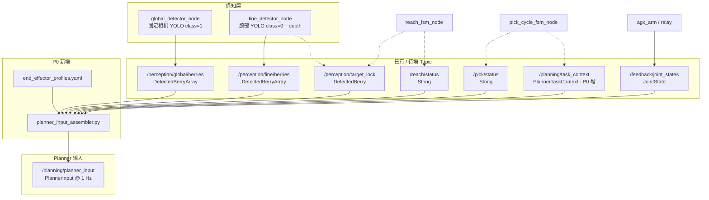

# Planner 输入数据框架（P0）

与 [`PICK_TRAJECTORY_PLANNER.md`](PICK_TRAJECTORY_PLANNER.md) 同步维护。  
P0 目标：**逐项核对模型输入是否具备、从哪来、缺什么、改哪段代码**；跑通 `planner_input_assembler` 发布 `/planning/planner_input`。

---

## 1. 数据流总图



---

## 2. 字段审计表

图例：**✅ 已有** · **⚠️ 部分** · **❌ 缺失** · **🔧 P0 改**

| 字段 | 状态 | 当前来源 | 缺口 / P0 改法 |
|------|------|----------|----------------|
| **scene.clusters[]** | ⚠️→🔧 | `/perception/global/berries`（实为 cluster，class=1） | 原 `global_detector` 只发 **1 个** best det；**P0 改为发全部簇**，并写 `class_id=1`、`bbox_*` |
| **scene.clusters[].id** | 🔧 | — | assembler 内用数组下标 `0..N-1` |
| **scene.clusters[].position** | ✅ | `DetectedBerry.pose`（fixed RGB-D mask/bbox median + TF→base_link） | 无 depth 则跳过该簇（不发明 mono pose）；`z_mono_m` 仅诊断 |
| **scene.clusters[].bbox_uv** | 🔧 | YOLO `bbox_xyxy` 未进 msg | **扩展 `DetectedBerry`** + global_detector 填入 |
| **scene.clusters[].confidence** | ✅ | `DetectedBerry.confidence` | — |
| **scene.berries[]** | ⚠️→🔧 | `/perception/fine/berries` | 腕部果 ✅；**固定相机单果 ❌**（global 只跑 class=1）→ P1 |
| **scene.berries[].id** | ✅ | `DetectedBerry.track_id`（fine） | — |
| **scene.berries[].position** | ✅ | fine：`pose` + depth → base_link | — |
| **scene.berries[].bbox_uv / image_uv** | 🔧 | YOLO bbox + UV | **P0 已写入 SceneBerry** |
| **scene.berries[].center_depth_m** | 🔧 | `z_depth_m` 优先，否则 `z_mono_m` | **P0** |
| **scene.berries[].surface_normal** | 🔧 | `berry_surface_fit` 深度环 PCA | **P0**：`normal_valid`；失败则零向量 |
| **scene.berries[].visible_wrist** | 🔧 | assembler：`fine` 列表内即 `true` | — |
| **scene.berries[].visible_global** | ❌ | — | P1：global class=0 |
| **scene.obstacles[]** | 🔧 | depth 点云 − 果 mask − 自碰撞区 → top-K 质心 | P1；语义见主文档 §5.1 |
| **ego.q_rad[6]** | ✅ | `/feedback/joint_states`（或 `/joint_states`） | 名序 `joint1..joint6` |
| **ego.qd_rad[6]** | ⚠️ | 同上 | 无 velocity 时填 0 |
| **task_context.fsm_state** | ⚠️→🔧 | `/reach/status` + `/pick/status` 字符串 | 无结构化 enum；**P0 assembler 映射**；可选 `/planning/task_context` |
| **task_context.cluster_id** | ⚠️ | `lock_region_decision.json` + `/perception/target_lock` | 运行时靠 **target_lock 与 cluster 列表最近邻** 反推 index；文件锁仅 QA |
| **task_context.fruit_id** | ⚠️→🔧 | `pick_cycle_fsm` 内部 `_fruit_index` / `FruitTarget.track_id` | **未发布**；P0 `pick_cycle_fsm` 发 `/planning/task_context` |
| **end_effector.*** | ❌→🔧 | `reach_fsm._cup_tip_offset_link6()` 硬编码 | **P0** `config/end_effector_profiles.yaml` + loader |

---

## 3. 各输入如何获得（运行时）

### 3.1 clusters（固定相机 · 簇）

| 步骤 | 说明 |
|------|------|
| 相机 | `/camera_fixed/color` + `/camera_fixed/depth` + `camera_info`（DaBai RGB-D） |
| 检测 | `global_detector_node`，YOLO unified `class_id=1`，见 `foundation_pose.yaml` |
| 3D | depth mask/bbox median → `K` 反投影 → TF → `base_link`；**禁止**直径 mono 作 pose |
| Topic | `/perception/global/berries`（历史命名；内容为 **簇** 非单果） |
| **代码** | [`global_detector_node.py`](../src/picking_perception/picking_perception/global_detector_node.py)：多簇 + RGB-D pose |

### 3.2 berries（腕部 · 单果）

| 步骤 | 说明 |
|------|------|
| 相机 | `/camera_wrist/color` + `/camera_wrist/depth` |
| 检测 | `fine_detector_node`，class=0，BoT-SORT `track_id` |
| 3D | depth mask median；缺 depth 则 coast/跳过（不发明 mono pose） |
| Topic | `/perception/fine/berries` |
| 锁果 | `/perception/target_lock` ← `reach_fsm` 发布，fine 跟 track |
| 法向 | `berry_surface_fit.fit_contact_surface`：bbox 中心深度环 PCA → `surface_normal_base`，朝向相机 |

#### SceneBerry 编码结构（模型输入）

| 字段 | 维数 | 用途 | 缺失哨兵 |
|------|------|------|----------|
| `id` | 1 | track / slot | — |
| `position` | 3 | base_link 果心/表面点 | 过滤掉 |
| `bbox_u0..v1` | 4 | 腕部像面框 | -1 |
| `image_u/v` | 2 | 框心 UV | -1 |
| `center_depth_m` | 1 | 相机光轴深度（优先 RGB-D） | -1 |
| `surface_normal` | 3 | base_link 单位法向（朝外 / 朝相机） | `normal_valid=false` → 零向量 |
| `track_source` | str | **`live`**=本帧检出更新；**`coast`**=世界系保持 | 必填 |
| `confidence` | 1 | 检测置信度 | — |
| `visible_wrist/global` | 2 | 相机可见 mask | — |
| `depth_mode` / `z_*` | diag | 训练 QA，可不进主干 token | — |

**建议 token 拼接（约 16 维/果）：**

```
[pos(3), normal(3), bbox_norm(4), center_depth_norm(1), conf(1), vis_w(1), vis_g(1), normal_valid(1)]
```

`bbox` 按源相机宽高归一化到 `[0,1]`；`center_depth` 除以工作距离上界（如 1.5 m）。  
法向进模型后，触达阶段的 `approach_axis` 监督可与 `-surface_normal` 对齐。

### 3.3 果–簇关联（进采果 FSM，非模型）

规则在 assembler / pick_cycle 共用：

```python
# 与 fruit_queue.filter_berries_in_cluster 相同
dist(berry.position, cluster.position) <= radius_m  # 默认 0.25
```

腕部可见：`fine` 列表非空且 `visible_wrist` 或 reach 侧 `fine_visible`（P1 可并入 assembler）。

### 3.4 obstacles（植株 / 盆沿 / 静态占据）

| 步骤 | 说明 |
|------|------|
| 语义 | **非果实、非臂本体** → 障碍（主文档 §5.1） |
| 点云 | fixed + wrist depth → `base_link`（复用 `FusedApproachMap` 投影链） |
| 扣除 | 所有 `berries[]` mask/bbox 内点；tip 自排除球（≈ cup_radius+2cm） |
| 聚合 | 3 cm 体素 → 占据计数 top-4 质心 → `SceneObstacle.position` |
| 可选 | `radius_m≈0.04`（msg 扩展）；`bbox_uv` 固定相机投影 debug |
| P0 | assembler 发 `obstacles=[]`；P1 `scene_graph_node` 或 assembler 内填充 |

---

### 3.5 ego（臂状态）

```bash
ros2 topic echo /feedback/joint_states --once
```

| 关节 | 说明 |
|------|------|
| joint1–joint5 | 规划 / IK 主用 |
| joint6 | 锁 0 |

### 3.6 task_context

**fsm_state 映射（P0 assembler 内）**

| reach/pick 状态 | planner `fsm_state` |
|-----------------|---------------------|
| pick `CLUSTER_*` | `CLUSTER_ALIGN` |
| pick `FRUIT_*` / reach `REFINING` | `APPROACH_FRUIT` |
| pick `FRUIT_RETRACT` | `RETRACT` |
| reach `ALIGNING` / `LOCKING` | `CLUSTER_ALIGN` |
| 其他 / IDLE | `IDLE` |

**cluster_id**：`/perception/target_lock` 有效时，与 `clusters[]` 中 position 欧氏距离最小者的 `id`。

**fruit_id**：采果循环中当前 `FruitTarget.track_id`（或 index）；由 `pick_cycle_fsm` 发布 `/planning/task_context`。

### 3.7 end_effector

```yaml
# config/end_effector_profiles.yaml
suction_cup_v1:
  tool_type_id: 0
  tip_offset_link6: [0.0, 0.01883, 0.06152]
  ...
```

加载：[`scripts/end_effector_profile.py`](../scripts/end_effector_profile.py)

---

## 4. P0 代码变更清单

| 优先级 | 文件 | 变更 |
|--------|------|------|
| P0-1 | `picking_msgs/msg/*.msg` | 新增 `PlannerInput`、`PlannerTaskContext`、`SceneCluster`、`SceneBerry` 等 |
| P0-2 | `DetectedBerry.msg` | `class_id`、`bbox_u0/v0/u1/v1` |
| P0-3 | `global_detector_node.py` | 多簇发布 + bbox/class_id |
| P0-4 | `fine_detector_node.py` | `class_id=0` + bbox + `center_depth_m` + 曲面法向 |
| P0-5 | `config/end_effector_profiles.yaml` | 末端 profile |
| P0-6 | `scripts/end_effector_profile.py` | YAML 加载 |
| P0-7 | `scripts/planner_input_assembler.py` | 1 Hz 组装 + 发布 |
| P0-8 | `pick_cycle_fsm_node.py` | 发布 `/planning/task_context` |
| P0-9 | `scripts/planner_input_recorder.py` + `record_planner_bag.sh` | **topic→rosbag** 录制 + viz |
| P0-10 | `docs/PICK_TRAJECTORY_PLANNER*.md` | 设计文档同步 |

**P0 验收**

```bash
cd blueberry_picking_ws && colcon build --packages-select picking_msgs picking_perception --symlink-install
source install/setup.bash
export PYTHONPATH="$(pwd)/scripts:${PYTHONPATH}"

python3 scripts/planner_input_assembler.py --end-effector suction_cup_v1
# 核对组装：topic 必须完整
ros2 topic echo /planning/planner_input --once

python3 scripts/planner_input_recorder.py --record-bag
# 或：bash scripts/record_planner_bag.sh
```

输出应包含：≥1 `clusters`（固定相机前）、`ego.q_rad` 有效、`end_effector` 已填；腕部有果时 `berries` 含 **bbox / center_depth / normal_valid**。`input_flags` 非 0 表示缺口。

---

## 5. 录制与可视化（数据闭环）

### 5.1 权威数据：ROS topic（训练 / 验组装）

| 项 | 内容 |
|----|------|
| **Topic** | `/planning/planner_input` |
| **类型** | `picking_msgs/msg/PlannerInput`（完整结构化输入） |
| **发布者** | `scripts/planner_input_assembler.py` @ 1 Hz |
| **训练录制** | **rosbag2**（不是 jsonl） |

```bash
# 验组装是否正确（先看 topic）
ros2 topic hz /planning/planner_input
ros2 topic echo /planning/planner_input --once
ros2 interface show picking_msgs/msg/PlannerInput

# 训练/回放用 bag（推荐）
bash scripts/record_planner_bag.sh
# 或与可视化一起：
python3 scripts/planner_input_recorder.py --record-bag

# 回放
ros2 bag info log/real_robot/planner_qa/<session>/bag
ros2 bag play  log/real_robot/planner_qa/<session>/bag
```

Bag 默认包含：`/perception/scene_graph`、`/perception/global|fine/berries`、`/planning/planner_input`、`/planning/task_context`、**`/planning/tool_trajectory_4s`**、**`/planning/ik_joint_trajectory`**、**`/planning/joint_cmd`**、**`/planning/executor_status`**、`/feedback/joint_states`、`/pick/status`、`/reach/status`、`/planning/viz/*`。

Debug 对照：原始感知 → scene_graph → planner_input；执行链 `tool_6D → ik_joints → joint_cmd → feedback`。executor 未起时后几个 topic 可能暂时无消息，bag 仍可录（空流）。

### 5.2 可视化 topic（看对不对）

| Topic | 说明 |
|-------|------|
| `/planning/viz/fixed` | 簇框 + LOCK |
| `/planning/viz/wrist` | 果框 + 深度 + 法向 |
| `/planning/viz/hud` | FSM / flags / q / berry 表 |
| `/planning/viz/status` | 一行摘要 |

### 5.3 jsonl / JPG（可选 sidecar，非训练真源）

`planner_input_sidecar.jsonl`、叠图、`replay.html` 仅方便人眼 QA；**后续训练必须读 bag 里的 `/planning/planner_input`**。启用：`--also-jsonl --save-frames`。

脚本：[`scripts/record_planner_bag.sh`](../scripts/record_planner_bag.sh)、[`scripts/planner_input_recorder.py`](../scripts/planner_input_recorder.py)

---

## 6. P1+ 待办（不阻塞 P0）

| 项 | 说明 |
|----|------|
| **obstacles** | depth 点云填充（§5.1） |
| **trajectory_episode_recorder** | bag → BC + 离线 RL replay |
| **tool_pose_ik** + executor | ✅ P0b（PBVS teacher） |
| 法向图像真投影 | recorder 当前用 base XY/Z 示意箭头；P1 用 `K` 投影 |

---

## 7. 与训练数据的关系

每条训练样本 = 一次 replan 快照：

```
/planning/planner_input  @ t0
+ joint_states[t0 : t0+4s]  → FK → tool 6D 标签（16 点）
```

P0 保证 **`/planning/planner_input` topic 完整可 echo / 可 bag**；训练读 bag，不读 jsonl。P1 再挂 episode 标签生成。

---

## 变更记录

| 日期 | 内容 |
|------|------|
| 2026-09-01 | global/fine pose 统一 RGB-D；取消 silent mono invent |
| 2026-09-01 | 明确权威源=topic+rosbag；jsonl 降为 sidecar |
| 2026-09-01 | berries 扩展 bbox/深度/法向；recorder+viz；文档同步 |
| 2026-08-31 | 初稿：输入审计、数据流图、P0 改码清单 |
